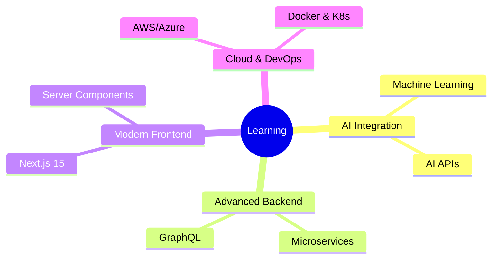

<div align="center">
# 👋 Hi, I'm Amani Ishimwe Samuel

### Full-Stack Developer | UI/UX Designer | Backend Specialist


</div>
---


---

## 🚀 About Me

I'm a passionate technologist who thrives at the intersection of **design** and  **development** . My mission is to create impactful, user-centric solutions that not only look beautiful but also deliver seamless experiences.

<div align="center">
🌐 **[View My Portfolio](https://amaniportofolio.netlify.app/)**

</div>
```ascii
     ┌─────────────────────────────────────┐
     │  "Design is not just what it looks  │
     │   like. Design is how it works."    │
     └─────────────────────────────────────┘
```


```ascii
     ┌─────────────────────────────────────┐
     │  "Design is not just what it looks  │
     │   like. Design is how it works."    │
     └─────────────────────────────────────┘
```---

## 💼 What I Do

<table>
<tr>
<td width="50%">
### 🎨 UI/UX Design

## 🛠️ Tech Stack

<div align="center">


</div>
---


---## 📊 GitHub Stats

<div align="center">


</div>
<div align="center">
[](https://git.io/streak-stats)

</div>
---


---## 🌱 Currently Exploring

<div align="center">


</div>
---


---## 🔥 Latest Activity

<div align="center">
<!--START_SECTION:activity-->
🚀 Building user-centric applications with modern tech stacks

🎨 Designing visually stunning and accessible interfaces

📚 Contributing to open source projects

🔧 Experimenting with cutting-edge frameworks and tools

<!--END_SECTION:activity-->

</div>
---


---## 📫 Let's Connect

<div align="center">
[](https://amaniportofolio.netlify.app/)
[](https://github.com/Amani-Ishimwe)
[](https://linkedin.com/in/amani-ishimwe)
[](mailto:your.email@example.com)

</div>
---


---
<div align="center">
### 💡 "Turning ideas into reality, one commit at a time"


⭐️ From [Amani-Ishimwe](https://github.com/Amani-Ishimwe)

</div>
